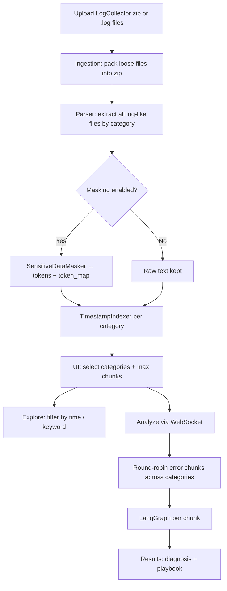
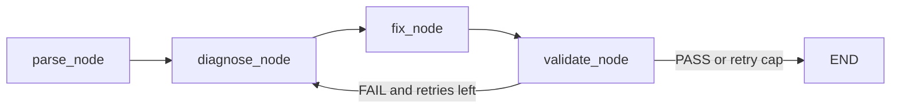

# LogResolve

AI-powered **IBM OpenPages LogCollector** analysis assistant. Upload a LogCollector zip (or loose `.log` files), mask sensitive values locally, explore by time/keyword, and run a cyclical **LangGraph** diagnosis workflow that returns root-cause findings and a remediation playbook.

**App version:** `1.0.0`  
**Repository:** https://github.com/amitkum262022/LogResolve

---

## Features

- FastAPI web UI (sidebar LLM config + main analysis workspace)
- Multi-LLM providers: **watsonx**, OpenAI, Anthropic, Gemini, local **Ollama**
- Zip or multi-file upload; all log-like files categorized (aurora, startup, reporting, cognos, liberty, solr, objectmanager, ffdc, plus filename stems)
- Local sensitive-data masking (IP, host, path, port tokens) before indexing or LLM calls
- Timestamp + keyword explore view with optional unmask (token map stays local)
- Partial analysis with configurable **max chunks** (round-robin across selected categories)
- WebSocket progress during analysis
- Persist LLM settings under `.local/llm_settings.json` (gitignored)

---

## Stack & dependency versions

Pinned ranges from `requirements.txt` (install resolves the newest compatible release within each range):

| Package | Version range |
|---------|----------------|
| langgraph | `>=0.2.0,<0.3.0` |
| langchain-core | `>=0.3.39,<0.4.0` |
| langchain-openai | `>=0.2.0,<0.3.0` |
| langchain-anthropic | `>=0.2.0,<0.4.0` |
| langchain-google-genai | `>=2.0.0,<3.0.0` |
| langchain-ibm | `>=0.3.8,<0.4.0` |
| ibm-watsonx-ai | `>=1.3.36,<2.0.0` |
| pydantic | `>=2.0.0,<3.0.0` |
| python-dateutil | `>=2.8.0,<3.0.0` |
| fastapi | `>=0.115.0,<1.0.0` |
| uvicorn[standard] | `>=0.30.0,<1.0.0` |
| python-multipart | `>=0.0.9,<1.0.0` |
| jinja2 | `>=3.1.0,<4.0.0` |
| itsdangerous | `>=2.1.0,<3.0.0` |

**Python:** developed against **3.13.x**. For **Python 3.14.4** production hosts, dependency upper bounds (especially LangChain / LangGraph 0.2–0.3) may need raising — validate in a 3.14 venv before deploy.

**Default models (UI):**

| Provider | Default model |
|----------|----------------|
| watsonx | `ibm/granite-4-h-small` |
| OpenAI | `gpt-4o` |
| Anthropic | `claude-sonnet-4-20250514` |
| Gemini | `gemini-2.0-flash` |
| Ollama | `llama3.1` |

**Runtime defaults:**

| Setting | Value |
|---------|--------|
| HTTP port | `8005` |
| Max validation retries (LangGraph) | `3` |
| Default max analysis chunks | `10` |
| Default watsonx URL | `https://us-south.ml.cloud.ibm.com` |
| Default Ollama base URL | `http://localhost:11434/v1` |

---

## Project layout

```text
LogResolve/
├── main.py              # FastAPI app, routes, WebSocket analyze
├── services.py          # Load / explore / analyze helpers
├── graph.py             # LangGraph: parse → diagnose → fix → validate
├── llm_factory.py       # Multi-provider chat model factory
├── ingestion.py         # Zip / loose-file upload sources
├── parser.py            # LogCollector zip extract + categorize + chunk
├── masking.py           # Sensitive token masking / unmask
├── timestamp_index.py   # Timestamp parse + filter index
├── settings_store.py    # Local LLM settings JSON
├── requirements.txt
├── templates/index.html
└── static/              # CSS + JS UI
```

---

## End-to-end flow



### 1. Load bundle

1. User uploads a LogCollector `.zip` and/or loose log files.
2. `LooseFilesUploadSource` builds an in-memory zip when needed.
3. `OpenPagesZipParser` extracts log-like members (zip-slip safe) into categories.
4. Optional masking replaces IPs, hosts, paths, ports with stable tokens (`<IP_1>`, …). **Token map never leaves the server session / local UI.**
5. Each category is indexed for timestamps (ISO-8601 and syslog-style).

> Load Bundle does **not** call the LLM. Only Analyze does.

### 2. Explore

- Pick category, keyword, optional start/end datetime.
- Optionally reveal originals using the local token map.
- Useful to sanity-check evidence before spending LLM budget.

### 3. Analyze

1. User selects categories and **max chunks**.
2. Error-like regions are chunked; chunks are taken **round-robin** across selected categories up to the limit.
3. Each chunk runs the LangGraph workflow (below).
4. Progress streams over `/ws/analyze`; partial results are kept if the run stops early.

---

## LangGraph diagnosis workflow

Operates only on **masked** text. Always terminates (max 3 validation retries, then force-pass).



| Node | Role |
|------|------|
| **parse_node** | Keep exceptions / stack traces / FATAL–ERROR context; drop routine INFO noise |
| **diagnose_node** | OpenPages-oriented root cause (JDBC pool, Cognos sync, Solr, Liberty SSL, ObjectManager, …) |
| **fix_node** | Numbered remediation playbook (`<OP_HOME>`, Liberty, JDBC, Cognos, Solr, cluster order) |
| **validate_node** | PASS/FAIL judge; on FAIL loops back to diagnose (up to 3 retries) |

---

## API surface

| Method | Path | Purpose |
|--------|------|---------|
| `GET` | `/` | HTML UI |
| `GET` | `/api/session` | Session id |
| `GET` / `POST` / `DELETE` | `/api/settings` | Load / save / clear LLM settings |
| `POST` | `/api/load` | Upload + extract + mask + index |
| `GET` | `/api/bundle` | Bundle / category status |
| `POST` | `/api/selection` | Selected categories + max chunks |
| `POST` | `/api/explore` | Filtered log lines |
| `WS` | `/ws/analyze` | Streaming analysis |
| `GET` | `/api/results` | Stored analysis results |

Static assets: `/static/*`

---

## Quick start

```bash
cd LogResolve
python -m venv .venv

# Windows
.venv\Scripts\activate

# macOS / Linux
source .venv/bin/activate

pip install -r requirements.txt
python -m uvicorn main:app --reload --host 127.0.0.1 --port 8005
```

Open **http://127.0.0.1:8005**

### First-run checklist

1. Open the config sidebar (arrow tab on the left edge of the main pane).
2. Choose an LLM provider and fill credentials (e.g. watsonx API key, project ID, URL, model).
3. Click **Save settings** (writes `.local/llm_settings.json`).
4. Upload a LogCollector zip / logs → **Load Bundle**.
5. Select categories, set max chunks → **Analyze**.

---

## Next phase enhancement — live / OpenPages-connected ingest

Today LogResolve is **upload-first** (LogCollector `.zip` or loose logs). A planned next phase is **OpenPages-connected** ingest so operators can pull diagnostics without manual file transfer.

### Why not true “live stream” via REST?

Official OpenPages LogCollector REST endpoints (`POST /v2/logs/collector`, `GET /v2/logs/collector/{process_id}`) were **deprecated and removed** around OpenPages **9.0.0.5+**. Continuous live log streaming over the public OpenPages API is therefore not a durable product path.

“Live” in practice means **on-demand or scheduled pull** of a fresh LogCollector package, then the same mask → index → explore → LangGraph pipeline.

### Extension point already in the codebase

`ingestion.py` defines `OpenPagesAPISource(LogBundleSource)` as a stub. Implementing `fetch_bundle()` to return zip bytes is enough for the rest of the app (parser, masking, UI) to stay unchanged.

### Recommended architecture

```text
OpenPages node(s)
   └─ LogCollector CLI / Admin UI job  (or host agent)
         └─ zip → agent URL / NFS / object storage / Orchestrate skill
               └─ LogResolve OpenPagesAPISource.fetch_bundle()
                     └─ existing parser → mask → analyze
```

| Approach | How “live”? | Notes |
|----------|-------------|--------|
| Agent on OP server runs `LogCollector.cmd` / `.sh` | Near real-time or cron | Best for on-prem |
| Admin UI LogCollector → shared folder / S3 | On demand or scheduled | Simple ops path |
| watsonx Orchestrate skill wrapping export | On demand | Fits IBM automation stacks |
| Direct REST LogCollector | Only if OP version still exposes it | Fragile; verify per tenant |

**Example host-side collect (paths/credentials are environment-specific):**

```bash
# <OP_HOME>/bin
LogCollector.cmd -f -l /var/op-logs -t latest.zip
```

### Planned product behavior

1. Sidebar (or ingest section): connection mode **Upload** | **Pull from OpenPages**.
2. Fields: OpenPages / agent base URL, auth token (or mTLS), optional poll interval.
3. **Fetch latest logs** → same bundle state as today’s **Load Bundle**.
4. Optional later: poll every *N* minutes, index only new lines, analyze new ERROR chunks.
5. Masking remains mandatory before any LLM call.

### Prerequisites from the OpenPages team

- OpenPages version (e.g. 9.0 / 9.1 / on Cloud)
- Whether LogCollector UI/CLI is enabled and how zips are stored
- Auth method (API key, OIDC, Basic, mTLS)
- Whether an agent or Orchestrate skill can run LogCollector and expose the zip

True continuous tailing of Liberty/aurora files would require a **custom agent** (e.g. Filebeat / `tail -F` → LogResolve), not stock OpenPages API — treat that as a separate stretch goal.

---

## Privacy & security notes

- Masking runs **before** indexing, chunking, and LLM calls when enabled.
- Token maps are for local “reveal original” only — do not log or ship them.
- `.local/`, `.env`, `extracted_logs/`, and `.venv/` are gitignored.
- Never commit API keys or real LogCollector dumps.

---

## License / ownership

Internal / project use as maintained by the repository owner. Configure cloud LLM usage under your own provider accounts and quotas.
